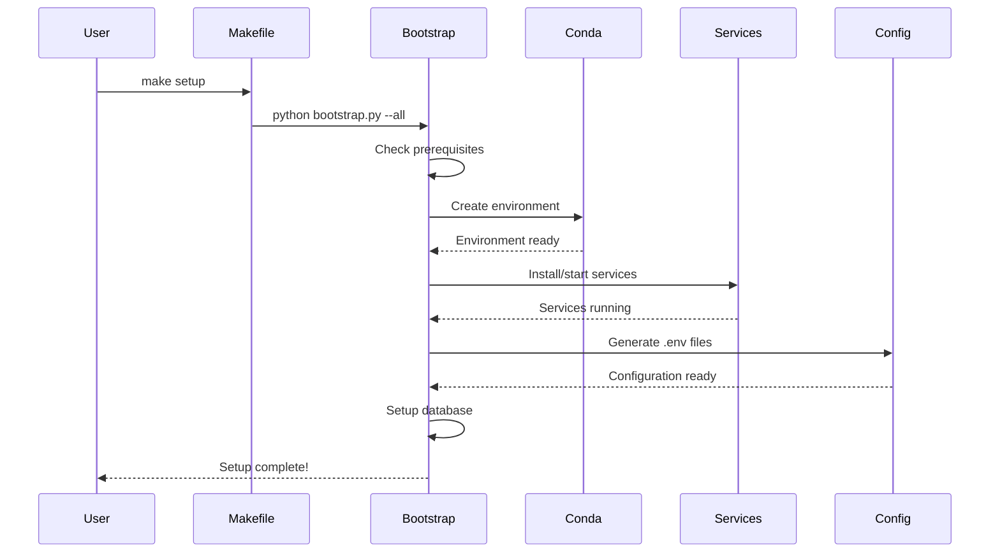
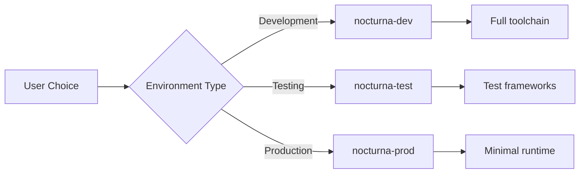

# Installation Architecture

## Overview

The Nocturna Calculations installation system follows a **unified, single-entry-point** architecture that provides consistency, simplicity, and maintainability across all environments and use cases.

## Design Principles

### 1. Single Source of Truth
- All dependencies defined in `setup.py`
- Environment configurations in `environments/` directory
- Service scripts in `scripts/services/`
- One Makefile as the primary interface

### 2. Separation of Concerns
- Package management (setup.py)
- Environment management (Conda)
- Service management (dedicated scripts)
- Orchestration (bootstrap script)

### 3. Progressive Disclosure
- Simple: `make setup` for beginners
- Detailed: Bootstrap script options for advanced users
- Manual: Individual components for experts

## Architecture Components

### Component Diagram

```
┌─────────────┐
│   Makefile  │ ← Single Entry Point
└──────┬──────┘
       │
       ▼
┌─────────────────┐
│ Bootstrap Script │ ← Orchestration
└────────┬────────┘
         │
    ┌────┴────┬──────────┬────────────┐
    ▼         ▼          ▼            ▼
┌──────┐  ┌────────┐  ┌────────┐  ┌──────┐
│Conda │  │Services│  │Database│  │Config│
│ Env  │  │Scripts │  │ Setup  │  │Files │
└──────┘  └────────┘  └────────┘  └──────┘
```

### 1. Makefile (Interface Layer)

**Purpose**: Provides a consistent, discoverable interface for all operations.

**Key Features**:
- Environment detection
- Command validation
- Colored output
- Help system
- Common aliases

**Example Commands**:
```makefile
setup:        # Complete setup
dev:          # Start server
test:         # Run tests
format:       # Format code
```

### 2. Bootstrap Script (Orchestration Layer)

**Location**: `scripts/bootstrap.py`

**Purpose**: Orchestrates the entire setup process with appropriate error handling.

**Responsibilities**:
- Conda environment creation
- Service installation coordination
- Database initialization
- Configuration file generation

**Key Functions**:
```python
create_environment()  # Conda env management
setup_services()      # PostgreSQL/Redis
create_env_files()    # Configuration
setup_database()      # DB initialization
```

### 3. Setup.py (Dependency Management)

**Purpose**: Single source of truth for all Python dependencies.

**Structure**:
```python
CORE_DEPS = [...]    # Minimal library deps
API_DEPS = [...]     # Server dependencies
DEV_DEPS = [...]     # Development tools
TEST_DEPS = [...]    # Testing frameworks
DOCS_DEPS = [...]    # Documentation tools

extras_require = {
    "api": API_DEPS,
    "dev": DEV_DEPS + TEST_DEPS + DOCS_DEPS,
    "test": TEST_DEPS,
    "all": ALL_DEPS
}
```

### 4. Environment Files (Environment Layer)

**Location**: `environments/`

**Structure**:
```
environments/
├── base.yml         # Shared base (future)
├── development.yml  # Dev environment
├── testing.yml      # Test environment
└── production.yml   # Prod environment
```

**Naming Convention**: `nocturna-{purpose}`

### 5. Service Scripts (Service Layer)

**Location**: `scripts/services/`

**Scripts**:
- `setup_postgres.sh`: PostgreSQL management
- `setup_redis.sh`: Redis management

**Interface**:
```bash
./setup_postgres.sh {check|install|start|setup}
./setup_redis.sh {check|install|start|test}
```

## Installation Flow

### Standard Flow



### Environment-Specific Flow



## Dependency Resolution

### Hierarchy
```
setup.py (source)
    ├── Core Dependencies (always installed)
    └── Extras (conditional)
        ├── api → API server deps
        ├── dev → All dev tools
        ├── test → Testing only
        └── docs → Documentation
```

### Installation Examples
```bash
# Development (includes everything)
pip install -e ".[dev,api]"

# Testing only
pip install -e ".[test]"

# Production API
pip install ".[api]"

# Core library only
pip install .
```

## Configuration Management

### Environment Variables
```
.env.example     # Template with all variables
.env             # Active configuration (git-ignored)
.env.development # Development defaults (future)
.env.testing     # Testing defaults (future)
.env.production  # Production template (future)
```

### Configuration Hierarchy
1. System environment variables
2. `.env` file
3. Default values in code

## Error Handling

### Graceful Degradation
- Missing services: Warning + instructions
- Missing conda: Error + installation link
- Failed commands: Clear error messages

### Recovery Options
- `--skip-services`: Continue without services
- `--skip-db`: Continue without database
- Manual service installation commands

## Cross-Platform Support

### Operating Systems
- **Linux**: Full support (apt/yum)
- **macOS**: Full support (homebrew)
- **Windows**: WSL required
- **Docker**: Future support planned

### Service Installation
```bash
# Linux (Debian/Ubuntu)
sudo apt-get install postgresql redis-server

# Linux (RHEL/CentOS)
sudo yum install postgresql-server redis

# macOS
brew install postgresql redis
```

## Best Practices

### For Package Maintainers
1. Update `setup.py` for dependency changes
2. Test all environments after changes
3. Update bootstrap script for new services
4. Document breaking changes

### For Developers
1. Use `make` commands consistently
2. Activate correct environment
3. Run `make update-deps` regularly
4. Check `make env-info` when debugging

### For CI/CD
1. Use production environment
2. Install minimal dependencies
3. Cache conda environments
4. Use `--skip-services` with containers

## Future Enhancements

### Planned Features
1. **Docker Integration**: Dockerfile generation from environments
2. **Environment Inheritance**: Base environment for shared deps
3. **Plugin System**: Custom setup steps
4. **Version Locking**: Reproducible environments
5. **Cloud Deployment**: AWS/GCP/Azure scripts

### Extensibility Points
- Custom environment types
- Additional service scripts
- Pre/post setup hooks
- Environment validation rules

## Comparison with Alternatives

### vs. Docker-only
- **Pros**: Native performance, better IDE integration
- **Cons**: Platform-specific setup

### vs. Virtualenv
- **Pros**: Better dependency resolution, environment management
- **Cons**: Requires Conda installation

### vs. Poetry/Pipenv
- **Pros**: Better scientific package support, service integration
- **Cons**: Larger ecosystem dependency

## Troubleshooting

### Common Issues

1. **Environment Activation**
   - Symptom: `make dev` fails
   - Solution: `conda activate nocturna-dev`

2. **Service Connection**
   - Symptom: Database errors
   - Solution: `make services-check`

3. **Dependency Conflicts**
   - Symptom: Import errors
   - Solution: `make update-deps`

### Debug Commands
```bash
make env-info        # Environment details
make services-check  # Service status
conda list          # Installed packages
pip show package    # Package details
```

## Conclusion

This architecture provides a robust, scalable foundation for project installation and environment management. It balances simplicity for new users with flexibility for advanced use cases, while maintaining consistency and best practices throughout. 