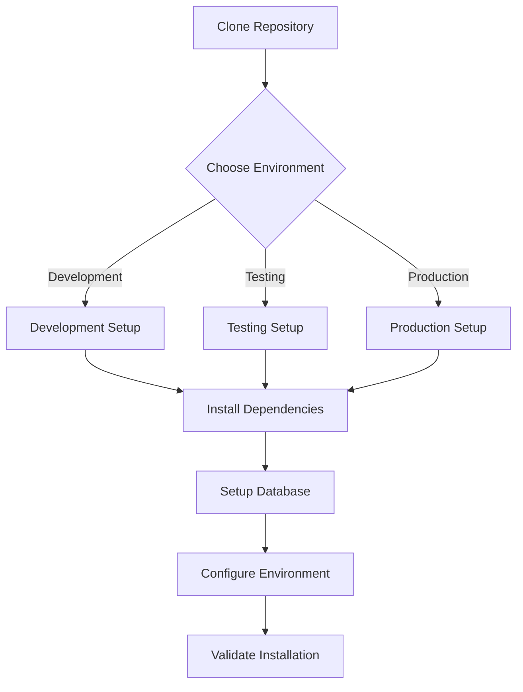

# Installation Guide Overview

Welcome to the Nocturna Calculations installation guide. This project supports multiple installation methods and environments to accommodate different use cases.

## Quick Start

### For Developers
```bash
# Clone and setup development environment
git clone https://github.com/eaprelsky/nocturna-calculations.git
cd nocturna-calculations
make setup-dev
```

### For Testers/QA
```bash
# Setup testing environment
make setup-test
```

### For Production Deployment
```bash
# Setup production environment
make setup-prod
```

## Installation Options

| Method | Use Case | Guide |
|--------|----------|-------|
| **Development Setup** | Feature development, debugging | [development-setup.md](development-setup.md) |
| **Testing Setup** | Running tests, benchmarks | [testing-setup.md](testing-setup.md) |
| **Production Setup** | Deployment, production use | [production-setup.md](production-setup.md) |

## Environment Management

This project uses **three separate conda environments** for different purposes:

- **`nocturna-dev`** (Python 3.11): Development work, debugging, feature development
- **`nocturna-test`** (Python 3.9): Testing, benchmarking, compatibility testing  
- **`nocturna-prod`** (Python 3.11): Production deployment, minimal dependencies

See [Environment Management Guide](../development/environment-management.md) for detailed information.

## Prerequisites

### System Requirements
- **Operating System**: Linux, macOS, or Windows with WSL
- **Conda**: Miniconda or Anaconda installed
- **Git**: For cloning the repository
- **Database**: PostgreSQL (auto-installed in development)
- **Cache**: Redis (auto-installed in development)

### Hardware Requirements
- **RAM**: Minimum 4GB, recommended 8GB+
- **Storage**: 2GB free space for development environment
- **CPU**: Any modern processor (calculations are CPU-intensive)

## Installation Workflow



## Quick Commands

```bash
# Environment management
make setup-dev          # Setup development environment
make setup-test         # Setup testing environment  
make setup-prod         # Setup production environment

# Environment switching
make switch-env ENV=dev   # Switch to development
make switch-env ENV=test  # Switch to testing

# Validation
make validate-env        # Validate current environment
make health-check        # Full system health check

# Development
make dev-server          # Start development server
make test               # Run test suite
make benchmark          # Run benchmarks

# Maintenance
make clean-env          # Clean environments
make update-deps        # Update dependencies
```

## Troubleshooting

Common issues and solutions:

- **Conda not found**: See [troubleshooting.md](troubleshooting.md#conda-issues)
- **Permission errors**: See [troubleshooting.md](troubleshooting.md#permission-issues)
- **Database connection**: See [troubleshooting.md](troubleshooting.md#database-issues)
- **Environment conflicts**: See [troubleshooting.md](troubleshooting.md#environment-conflicts)

## Support

If you encounter issues:

1. Check the [troubleshooting guide](troubleshooting.md)
2. Validate your environment: `make validate-env`
3. Check existing [GitHub issues](https://github.com/eaprelsky/nocturna-calculations/issues)
4. Create a new issue with:
   - Your operating system
   - Python/Conda versions
   - Error messages
   - Steps to reproduce

## Next Steps

After installation:

1. **Developers**: Read the [Development Guide](../development/README.md)
2. **Testers**: Read the [Testing Strategy](../development/testing-strategy.md)
3. **Users**: Check the [API Documentation](../api/README.md)
4. **Contributors**: Review [Contributing Guidelines](../development/contributing-guide.md) 